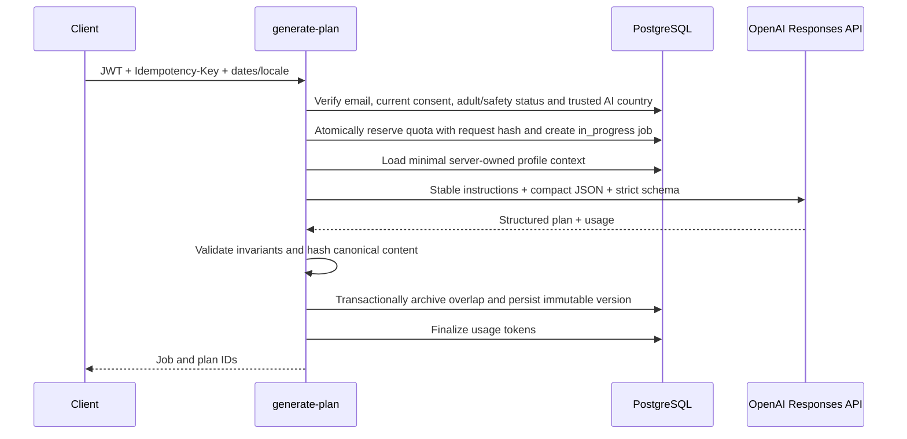

# AI architecture

## Provider boundary

Only `generate-plan`, `coach` and `analyze-body-composition` call OpenAI. They use the Responses API with
`text.format.type = json_schema`, `strict = true`, server-side secrets and
`store = false`. OpenAI documents Structured Outputs as the preferred way to
enforce schema adherence, while application-side validation remains a defense
in depth: [Structured Outputs](https://developers.openai.com/api/docs/guides/structured-outputs).

The default model is not compiled into application code. Deployments set
`OPENAI_PLAN_MODEL`, `OPENAI_COACH_MODEL` and
`OPENAI_BODY_COMPOSITION_MODEL` independently. This preserves a
quality-first planning route and a lower-latency coaching route without silently
sending every workload to the most expensive model. Current model and prompting
guidance should be rechecked before changing those secrets:
[model selection](https://developers.openai.com/api/docs/guides/latest-model.md),
[GPT-5.6 prompting](https://developers.openai.com/api/docs/guides/prompt-guidance-gpt-5p6.md).

## Plan generation

The user supplies only goal selection, start date, duration and locale. Profile,
health, body composition and training context are loaded by verified user ID.
Display name and email are deliberately excluded from the prompt.

Schema version `1.0.0` is canonical and single-locale (`content_locale`). It
contains daily target strategy/final targets, meals with ingredients, nutrition
confidence/provenance and nullable recipes, workouts with exercises/sets/reps/
rest/equipment/substitutions, grocery and restaurant guidance, and structured
health/safety notes. AI-authored nutrition is constrained to
`source=model_estimate`; future catalog/import writers may carry trusted source
labels through the dashboard projection.

Post-output checks reject duplicate day/slot/option/exercise keys, invalid
ranges, inconsistent macro calories, a default meal set that misses the day's
target, a calorie target below the configured deterministic floor, and direct
matches for declared allergens. Only body-composition rows with status
`confirmed` or manual `not_requested` are prompt inputs.

## Coach

Coach requests rebuild a compact context from the latest goal, dietary
constraints, check-in, optional memory summary and ten recent messages. Provider
conversation storage and `previous_response_id` are not used; `store=false`
keeps the application database as the conversation source of truth.

The structured response separates reply, one optional follow-up, suggested
actions and safety level. The assistant is explicitly prohibited from diagnosis,
medication changes, extreme restriction, purging or unsafe exercise. This is a
guardrail, not clinical certification; urgent-safety evals and human review are
required before launch.

## Body-composition extraction

`analyze-body-composition` downloads an owner-scoped object from the private
bucket with the service role. It accepts only PDF/JPEG/PNG/WebP up to 10 MiB and
sends the bytes directly to a multimodal Responses request. The strict schema
requires a value, unit, confidence and short visible evidence per supported
field. Missing or unclear values must be null; application validation rejects
non-null observations below 0.8 confidence and out-of-range normalized values.

Extraction writes normalized values with `needs_confirmation`. The
`confirm-body-composition` account RPC is the only trusted state transition to
`confirmed`; it accepts only a measurement ID and never client-supplied metrics.
Plan generation ignores pending, processing, failed and unconfirmed reports.

## Eligibility and kill switches

Every AI route fails closed unless `AI_MASTER_ENABLED=true` and its feature
switch is true. It also requires a confirmed email, current versioned legal/
privacy/health consent, completed non-blocked onboarding, an entitlement and a
server-verified billing country. The verified country fields are service-only
and can be set later by an approved payment provider or admin review. Draft,
manual and IP country values are display hints and never authorize AI. Iran is
always denied even if it appears in the environment allowlist.

`AI_MAX_REQUESTS_PER_DAY` and `AI_CIRCUIT_WINDOW_SECONDS` back an atomic global
database circuit breaker. They are an emergency cost ceiling by request count;
the master/feature switches remain the authoritative immediate shutdown. A
monetary cap can replace the request ceiling after provider cost is calculated
from a versioned model-price table.

## Token and cost controls

- Keep the stable role/safety/schema prefix unchanged to improve prompt-cache
  reuse; OpenAI's current guidance recommends trimming repeated instructions and
  preserving stable reusable prefixes.
- Send compact JSON rather than the previous full Markdown contract and example.
- Calculate dates, IDs, entitlement, activation and deterministic validation in
  code/SQL rather than asking the model.
- Limit history, requested plan days, options, output tokens and request body size.
- Version prompts and JSON schemas independently.
- Record input/output/cached/reasoning tokens by successful request.
- Bound global provider attempts with the database circuit breaker.
- Compare models and reasoning levels with real plan-quality and safety evals;
  never optimize cost from token counts alone.

## Failure and reconciliation

The provider and PostgreSQL do not share a transaction. Each usage reservation
stores the request SHA-256, an attempt token and terminal state. A key reused
with different input is rejected; only the caller that owns the attempt token
can finalize it. Concurrent replays see `in_progress` instead of making a
second paid call. Jobs and usage reservations expose split failures.
A scheduled reconciliation process should:

1. release reservations whose job never started;
2. mark stale `in_progress` jobs failed;
3. finalize a reserved ledger entry when its plan/message already exists;
4. alert on repeated provider/schema failures without logging health payloads.

Plan validation or persistence failure never activates partial model output.
