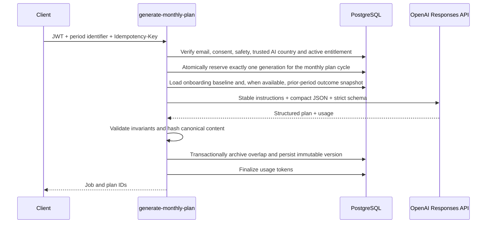

# AI architecture

## Provider boundary

Only `generate-monthly-plan` calls OpenAI. It uses the Responses API with
`text.format.type = json_schema`, `strict = true`, server-side secrets and
`store = false`. OpenAI documents Structured Outputs as the preferred way to
enforce schema adherence, while application-side validation remains a defense
in depth: [Structured Outputs](https://developers.openai.com/api/docs/guides/structured-outputs).

The default model is not compiled into application code. Deployments set
`OPENAI_PLAN_MODEL`. This preserves a quality-first monthly planning route without
creating any additional or conversational workload. Current model and prompting
guidance should be rechecked before changing those secrets:
[model selection](https://developers.openai.com/api/docs/guides/latest-model.md),
[GPT-5.6 prompting](https://developers.openai.com/api/docs/guides/prompt-guidance-gpt-5p6.md).

## Monthly plan generation

For month one, the context is built from the confirmed onboarding baseline. For
month two and later, the server first verifies an active subscription and adds
the previous active plan, adherence, completed workouts/meals, measurements,
check-ins, profile changes and safety signals. Profile,
health, body composition and training context are loaded by verified user ID.
Display name and email are deliberately excluded from the prompt.

The single response contains the complete monthly workout and nutrition content.
Valid output is imported automatically as an immutable plan version with
an effective period. The first cycle begins when that import succeeds: the
server writes `ready_at`, uses it as `starts_at`, and derives `ends_at` one
user-timezone calendar month later. Provider or validation failure leaves the
previous stored plan intact. Until import succeeds, the same job may retry the
provider after a delay. After successful import, a replay never retries the
provider and cannot create duplicate usage or plan versions.

No chat, coach message, conversation history, on-demand adjustment, or extra AI
turn exists. The next monthly prompt may include aggregated weekly general
reports. Those reports are not themselves an AI call.

Schema version `1.0.0` is canonical and single-locale (`content_locale`). It
contains daily target strategy/final targets, meals with ingredients, nutrition
confidence/provenance and nullable recipes, workouts with exercises/sets/reps/
rest/equipment/substitutions, grocery and restaurant guidance, and structured
health/safety notes. AI-authored nutrition is constrained to
`source=model_estimate`; future catalog/import writers may carry trusted source
labels through the dashboard projection.

Post-output checks reject duplicate day/slot/option/exercise keys, invalid
ranges, inconsistent macro calories, a default meal set that misses the day's
target, a calorie target below the configured deterministic floor, and direct
matches for declared allergens. Only body-composition rows with status
`confirmed` or manual `not_requested` are prompt inputs.

## Period snapshot

The application database—not a conversation transcript—is the source of truth.
At period close, deterministic aggregation creates a compact snapshot of planned
versus completed workouts and meals, adherence, measurement trends, check-ins,
declared profile changes and safety signals. Raw free text is excluded unless a
separately approved field is explicitly required. The next monthly prompt treats
the snapshot as untrusted structured data and never grants it tool or database
authority.

## Body-composition input

Body-composition data never starts a separate model request. A report may be
stored privately as user evidence, but values used for planning must be entered
or extracted with a non-generative tool and explicitly confirmed before the
monthly request. The single generation call receives only normalized,
range-checked, confirmed values.

## Eligibility and kill switches

Every AI route fails closed unless `AI_MASTER_ENABLED=true` and its feature
switch is true. Monthly generation also requires a confirmed email, current versioned legal/
privacy/health consent, completed non-blocked onboarding, an active entitlement and a
payment method on file. Sticky `product_region` selects locale and list currency
only. Draft IP is used once at signup and never authorizes or blocks AI.

`AI_MAX_REQUESTS_PER_DAY` and `AI_CIRCUIT_WINDOW_SECONDS` back an atomic global
database circuit breaker. They are an emergency cost ceiling by request count;
the master/feature switches remain the authoritative immediate shutdown. A
monetary cap can replace the request ceiling after provider cost is calculated
from a versioned model-price table.

## Token and cost controls

- Keep the stable role/safety/schema prefix unchanged to improve prompt-cache
  reuse; OpenAI's current guidance recommends trimming repeated instructions and
  preserving stable reusable prefixes.
- Send compact JSON rather than the previous full Markdown contract and example.
- Calculate dates, IDs, entitlement, activation and deterministic validation in
  code/SQL rather than asking the model.
- Limit prior-period snapshot size, plan days, options, output tokens and request body size.
- Version prompts and JSON schemas independently.
- Record input/output/cached/reasoning tokens by successful request.
- Bound global provider executions with the database circuit breaker; each user
  cycle has at most one in-flight generation job and at most one successfully
  imported plan.
- Compare models and reasoning levels with real plan-quality and safety evals;
  never optimize cost from token counts alone.

## Failure and reconciliation

The provider and PostgreSQL do not share a transaction. Each usage reservation
stores the request SHA-256, an attempt token and terminal state. A key reused
with different input is rejected; only the caller that owns the attempt token
can finalize it. Concurrent replays see `in_progress` instead of making a
second call. A replay only reads or reconciles the original job while it is
alive. Until import succeeds, transient provider or validation failure retries
the same job after a delay (at most two automatic retries, three attempts). The
user-facing wait times out at 3 minutes with a visible error and retry. After
successful import, no model retry, fallback model, or second prompt is allowed.
Jobs and usage reservations expose split failures.
A scheduled reconciliation process should:

1. release reservations whose provider execution never started;
2. mark stale `in_progress` jobs failed;
3. finalize a reserved ledger entry when its immutable plan version already exists;
4. alert on repeated provider/schema failures without logging health payloads.

Plan validation or persistence failure never activates partial model output.
