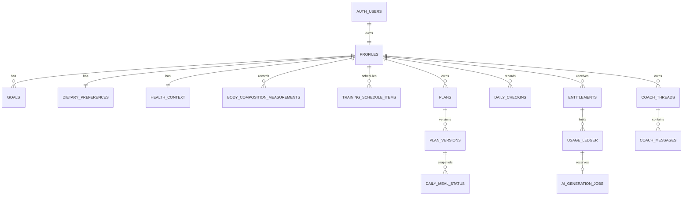

# Momentum data model

## Ownership boundary

`auth.users.id` is the only account identity. Every sensitive row either has an
indexed `user_id` or is reachable through an owner-bound composite foreign key.
Model output, imports and request bodies can never choose another user ID.

## Profile and sensitive context

- `profiles` contains identity-adjacent preferences, timestamped consent
  versions, automation safety state and service-only AI billing-country
  verification. Self-declared `country_code` never grants AI access.
- `onboarding_drafts` contains only the authenticated user's partial flow state;
  `complete_onboarding` locks and validates it, normalizes all domain tables in
  one transaction, caches an idempotent response, then deletes the draft.
- `health_context` is separated so ordinary profile queries do not accidentally
  retrieve medication or medical consideration fields.
- `body_composition_measurements` supports `pending -> processing ->
  needs_confirmation -> confirmed`, with `failed` retry state and
  `not_requested` for manual input. Report files live in private
  `body-composition/{user_id}/...` paths. AI-normalized values are excluded from
  planning until a service RPC confirms the already-persisted extraction.
- Store date of birth, not age; age is derived for the plan start date.

## Plans

`plans` describes ownership, activation and date range. `plan_versions` stores an
immutable, schema-versioned JSONB document plus a SHA-256 digest, prompt version,
model and generation job. Only the service role writes either table.

Only one active plan can cover a user's date because a PostgreSQL exclusion
constraint rejects overlapping active date ranges. A generated replacement
archives an overlapping plan inside the same database transaction.

Daily selections reference the exact immutable `plan_version_id` and retain
title/nutrition snapshots. Historical logs therefore remain intelligible after
later plan versions are created.

## AI, subscriptions and usage

- `entitlements` define a non-overlapping active/trial allowance period.
- `usage_ledger` atomically reserves one plan generation, coach message or body
  report extraction using an idempotency key, request digest and attempt token.
- `ai_generation_jobs` records status, prompt/model version, provider response ID
  and a context fingerprint, but not raw prompts in logs.
- Provider token counts are finalized into the ledger. Monetary cost is nullable
  until a versioned model-price calculator is added.
- `product_prices` is a display catalog. Checkout must independently resolve the
  authoritative market and amount on the server.

## Dates, locale and region

- PostgreSQL stores timestamps as `timestamptz` and calendar log dates as `date`.
- User timezone determines their local day; it is validated against PostgreSQL's
  timezone catalog and is never inferred from server timezone. Dashboard and
  meal-mutation dates are derived from this stored value. A client-supplied date
  is, at most, a same-day assertion and never the source of authority.
- Language (`locale`), pricing market, currency, self-declared country, verified
  AI billing country and cuisine region are separate concepts. IP/manual values
  only suggest display/food defaults. A trusted payment/admin process must set
  the three service-only AI country verification fields.
- Raw IP addresses are not stored by this design.

## Data retention

Recommended initial policy:

- onboarding drafts: delete transactionally after completion, otherwise after 30 days;
- raw body reports: delete after extraction/confirmation unless the user opts to retain;
- failed AI jobs: retain metadata for 30 days, never full provider errors;
- coach content: user-controlled export/delete, with a configurable retention window;
- audit events: retain minimal metadata for security/account investigations;
- account deletion: cascade database rows, delete Storage objects, revoke sessions,
  then record only an anonymized deletion receipt outside the user database.
