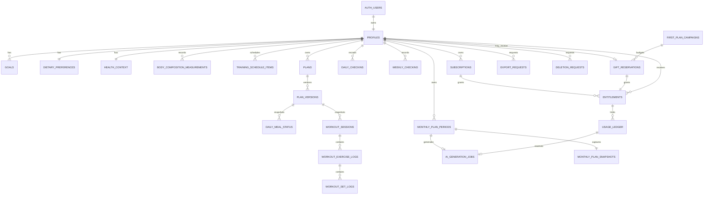

# Momentum data model

## Ownership boundary

`auth.users.id` is the only account identity. Every sensitive row either has an
indexed `user_id` or is reachable through an owner-bound composite foreign key.
Model output, imports and request bodies can never choose another user ID.

## Profile and sensitive context

- `profiles` contains identity-adjacent preferences, timestamped consent
  versions, automation safety state, and sticky `product_region` (`ir` | `intl`)
  with `product_region_source` and `product_region_locked_at`. Signup IP may
  write this once. Later IP never updates it. Self-declared residence is
  profile data, not an AI gate.
- `onboarding_drafts` contains only the authenticated user's partial flow state;
  `complete_onboarding` locks and validates it, normalizes all domain tables in
  one transaction, caches an idempotent response, then deletes the draft.
- `health_context` is separated so ordinary profile queries do not accidentally
  retrieve medication or medical consideration fields.
- `body_composition_measurements` stores normalized user-confirmed values.
  Optional report files may live in private `body-composition/{user_id}/...`
  paths as evidence, but no separate model extracts them. Unconfirmed values are
  excluded from monthly planning.
- Store date of birth, not age; age is derived for the plan start date.

## Plans

`plans` describes ownership, activation and date range. `plan_versions` stores an
immutable, schema-versioned JSONB document plus a SHA-256 digest, prompt version,
model and generation job. Only the service role writes either table.

Only one active plan can cover a user's date because a PostgreSQL exclusion
constraint rejects overlapping active date ranges. A generated replacement
archives an overlapping plan inside the same database transaction.

Daily selections reference the exact immutable `plan_version_id` and retain
title/nutrition snapshots. Historical logs therefore remain intelligible after
later plan versions are created.

Workout sessions similarly retain the active version plus planned exercise,
set, rep and rest snapshots. Only owner-bound RPCs mutate workout execution;
RLS clients can read but cannot directly write these health/activity logs.

## AI, subscriptions and usage

- `subscriptions` stores one product subscription and its server-verified
  lifecycle (`active`, `grace`, `payment_pending`, `cancelled`, `expired`) plus
  processor/customer references protected from ordinary clients. There are no
  tier-specific capability columns.
- `first_plan_campaigns` stores the server-owned enable switch, allowed markets,
  conservative reservation cost and total budget. `gift_reservations` atomically
  binds at most one eligible person to reserved/consumed/released status without
  exposing budget internals to the client.
- `entitlements` define non-overlapping paid cycles or the one-time,
  budget-reserved first-plan gift. Gift exhaustion never mutates an existing
  entitlement.
- `monthly_plan_periods` uniquely identifies one user and monthly plan cycle,
  records entitlement verification, generation/import state, and the resulting
  immutable plan version.
- `ready_at` is written only after a validated version is imported and activated.
  `starts_at = ready_at`; `ends_at` is derived as one user-timezone calendar month
  later. Billing calendar boundaries never redefine an active plan cycle.
- `monthly_plan_snapshots` stores the minimized structured onboarding baseline
  and, from month two onward, the previous plan plus adherence/outcome summary.
- `usage_ledger` atomically reserves the user's single monthly plan generation
  using an idempotency key, request digest and attempt token.
- `ai_generation_jobs` records status, prompt/model version, provider response ID
  and a context fingerprint, but not raw prompts in logs.
- Provider token counts are finalized into the ledger. Monetary cost is nullable
  until a versioned model-price calculator is added.
- `product_prices` is a display catalog. Checkout must independently resolve the
  authoritative market and amount on the server.

## Check-ins, next-cycle input and account control

- `weekly_checkins` store the user's general weekly report (owner/week uniqueness).
  They do not call AI and do not rewrite the active month. They may enter the next
  monthly snapshot. Subjective unanswered values remain null.
- Meal and workout completion are daily execution of the imported month, not a
  second planning ritual.
- `next_cycle_inputs` (or equivalent period-owned fields) stores structured
  profile-change references and one optional note capped at 500 characters with
  soft UI guidance from 400. The note has explicit
  length/retention/safety rules and is absent from general analytics. No row is
  required for default carry-forward.
- `notification_preferences` separates desired product reminders from OS/browser
  permission state; denial is not stored as user intent.
- `export_requests` records requester, scope, durable status, artifact expiry and
  privacy-safe error metadata. Export artifacts use private owner-scoped storage.
- `deletion_requests` records confirmation, orchestration status and minimal
  receipts for Auth/database/Storage/subprocessor deletion. Completion revokes
  sessions; an anonymized receipt may remain under the approved retention policy.

## Dates, locale and region

- PostgreSQL stores timestamps as `timestamptz` and calendar log dates as `date`.
- User timezone determines their local day; it is validated against PostgreSQL's
  timezone catalog and is never inferred from server timezone. Dashboard and
  meal-mutation dates are derived from this stored value. A client-supplied date
  is, at most, a same-day assertion and never the source of authority.
- Language defaults and list currency follow sticky `product_region` (`ir` →
  fa+IRR, `intl` → en+USD). Calendar, units, timezone, cuisine, and
  self-declared residence remain separate. IP is used only to set
  `product_region` at signup. Raw IP addresses are not stored by this design.

Required `profiles` columns for D12:

| Column | Type | Rule |
| --- | --- | --- |
| `product_region` | `ir` \| `intl` | NOT NULL after signup |
| `product_region_source` | `ip_at_signup` \| `admin` | audit |
| `product_region_locked_at` | timestamptz | set once; later IP must not update |

## Data retention

Recommended initial policy:

- onboarding drafts: delete transactionally after completion, otherwise after 30 days;
- raw body reports: delete after manual confirmation unless the user opts to retain;
- failed AI jobs: retain metadata for 30 days, never full provider errors;
- monthly plan snapshots: retain with the corresponding plan history until user
  deletion or the approved product retention period;
- audit events: retain minimal metadata for security/account investigations;
- account deletion: cascade database rows, delete Storage objects, revoke sessions,
  then record only an anonymized deletion receipt outside the user database.
